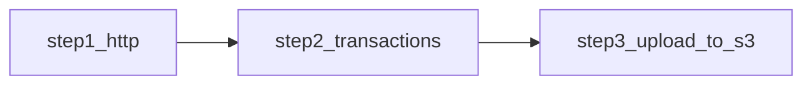

# dbt Affiliate API Project
## project name: dbt_affiliate_api

## Table of Contents

- [1. Introduction](#introduction)
- [1.1 Benefits of DuckDB and dbt](#benefits-of-duckdb-and-dbt)
- [2. Supported Affiliate Networks](#supported-affiliate-networks)
- [3. Prerequisites](#prerequisites)
- [4. Dependencies and `requirements.txt`](#dependencies-and-requirements)
- [5. Project Configuration](#project-configuration)
- [6. `affiliate_config.yml`](#affiliate-config)
- [7. Models](#models)
- [7.1 `step1_http`](#step1-http)
- [7.2 `step2_transactions`](#step2-transactions)
- [7.3 `step3_upload_to_s3`](#step3-upload-to-s3)
- [8. Local Run Commands](#local-run-commands)

<a id="introduction"></a>

## 1. Introduction

Affiliate marketing allows UNiDAYS to earn commission when members click through partner links and complete eligible purchases or conversions with an affiliate network. Each network exposes its own API endpoints for transactions, validations, commissions, or actions, usually over REST and JSON with bearer-token authentication, and in some cases basic authentication or POST-based query payloads.

This project extracts that affiliate data from those network APIs, lands the raw results in DuckDB, transforms the payloads with dbt, and exports parquet files for downstream loading. The API call layer is kept in Python where authentication, retries, request templating, and pagination belong; the data-shaping layer is kept in SQL with Jinja so the transformation logic stays readable and easier to maintain than a Python-heavy pipeline.



<a id="benefits-of-duckdb-and-dbt"></a>

### 1.1 Benefits of DuckDB and dbt

- DuckDB provides a lightweight local execution engine with file-based storage, which is a good fit for API ingestion, staging, and parquet export.
- dbt gives the pipeline explicit model lineage, repeatable runs, and templated configuration through Jinja.
- Python is used only for the parts that genuinely need code: HTTP requests, auth headers, retries, request history, and pagination.
- SQL is used for the parts that are easier to review and change in a data project: selecting columns, hashing payloads, and dynamically extracting nested JSON components.
- Jinja keeps the per-network differences declarative, so changes to child JSON extraction can be made in SQL rather than buried in Python branching.

<a id="supported-affiliate-networks"></a>

## 2. Supported Affiliate Networks

The project currently supports the following network definitions from `affiliate_config.yml`:

| Network Name | Network ID |
| --- | ---: |
| `awin_transactions` | 7 |
| `awin_validations` | 7 |
| `commission_factory` | 13 |
| `commission_junction` | 17 |
| `hasoffers` | 67 |
| `impact_radius` | 21 |
| `partnerize` | 30 |
| `pepperjam` | 37 |
| `rakuten` | 25 |
| `tradedoubler` | 52 |
| `webgains` | 42 |

<a id="prerequisites"></a>

## 3. Prerequisites

- Python 3.11 or higher
- A writable DuckDB parent directory, set with `AFFILIATE_DUCKDB_PATH`
- A dbt environment with `dbt-duckdb`
- Network credential environment variables for the feed being run
- AWS credentials if parquet output is written to S3 rather than a local directory

<a id="dependencies-and-requirements"></a>

## 4. Dependencies and `requirements.txt`

This repo currently manages Python dependencies in `pyproject.toml`. It does not include a separate `requirements.txt`.

The runtime dependencies are:

```sh
dependencies = [
  "dbt-duckdb>=1.8.0",
  "duckdb>=1.1.0",
  "Jinja2>=3.1.0",
  "pandas>=3.0.1",
  "pyarrow>=23.0.1",
  "PyYAML>=6.0.0",
  "requests==2.32.5",
]
```

One straightforward install flow is:

```bash
/home/mahmed/dbt_venv/bin/pip install build wheel
cd /home/mahmed/UD.Data.Affiliate-API-temp
/home/mahmed/dbt_venv/bin/python -m build --wheel --no-isolation
```

This creates a wheel in `dist/`, for example:

```text
dist/dbt_affiliate_api-0.1.0-py3-none-any.whl
```

The wheel process works as follows:

- `setup.py` stages the runtime dbt assets from the repo root into the wheel at build time.
- The wheel includes `affiliate_config.yml`, `dbt_project.yml`, `profiles.yml`, and the `models/` files.
- The installed helper package is `dbt_affiliate_api_bundle`, and it exposes an `affiliate-api-paths` command that prints the installed dbt project and profiles directory.

Install the wheel with:

```bash
pip install /path/to/dist/dbt_affiliate_api-0.1.0-py3-none-any.whl
```

After installation, get the packaged project paths with:

```bash
affiliate-api-paths --format json
```

or:

```bash
affiliate-api-paths --format shell
```

That output can be used to set:

- `DBT_AFFILIATE_PROJECT_DIR`
- `DBT_AFFILIATE_PROFILES_DIR`
- `DBT_AFFILIATE_MODULE_PATH`

Ensure MWAA `requirements.txt` contains the above dependencies if MWAA is installing them separately from the wheel.

<a id="project-configuration"></a>

## 5. Project Configuration

The project is controlled by four main files:

- `dbt_project.yml`: dbt project name, profile name, default vars, and model config
- `profiles.yml`: DuckDB targets and target-specific database file names
- `.env`: local environment variables that can be sourced into the shell before running dbt
- `affiliate_config.yml`: affiliate network metadata, credential variable names, request templates, response parsing, and pagination rules

`AFFILIATE_DUCKDB_PATH` should be the parent directory only. Each target appends its own database file name. For example, the `awin_transactions` target resolves to:

```text
<AFFILIATE_DUCKDB_PATH>/affiliate_awin_transactions.duckdb
```

<a id="affiliate-config"></a>

## 6. `affiliate_config.yml`

`affiliate_config.yml` is the source of truth for the generic affiliate pipeline. It describes:

- which networks and feeds are available
- which credential environment variables are required
- the HTTP method, URL, headers, query string, and optional request body
- where the records live in the response payload
- which pagination pattern the handler should use
- which nested JSON objects or arrays should be broken out later in SQL

Example:

```yml
affiliate_defaults:
  api_max_retry: 5
  api_retry_delay: 10

affiliate_pipelines:
  - network_id: 7
    network_name: awin_transactions
    account_name: Awin Unidays INC US
    credentials:
      api_token: AFFILIATE_AWIN_API_TOKEN
    feeds:
      - feed_id: transactions
        feed_name: transactions
        program_id: "533915"
        child_json_items:
          - transactionParts
          - basketProducts
        request:
          method: GET
          url_template: https://api.awin.com/publishers/[[ program_id ]]/transactions/
          query_params_template: >
            endDate=[[ end_date | format_datetime("%Y-%m-%dT%H:%M:%SZ") ]]&
            timezone=UTC&
            dateType=transaction&
            showBasketProducts=true&
            startDate=[[ start_date | format_datetime("%Y-%m-%dT%H:%M:%SZ") ]]
          headers_template: |
            {
              "Authorization": "Bearer [[ api_token ]]",
              "Accept": "application/json"
            }
        response:
          records_path: $
        pagination:
          mode: none
```

<a id="models"></a>

## 7. Models

<a id="step1-http"></a>

### 7.1 `step1_http`

`step1_http` is the Python extraction model. It resolves the selected feed from `affiliate_config.yml`, builds the request window, executes the API calls through the shared network handler, and writes one row per raw record into DuckDB.

It also materializes a separate `step1_http_header` table that stores request and response audit information such as:

- request URL
- request payload
- response payload
- request and response timestamps
- page record count
- export path
- success flag

Key vars used by `step1_http`:

- `affiliate_network_name`: selects the network/feed definition from `affiliate_config.yml`
- `lookback_days`: used to derive `start_date` when `end_date` is supplied or defaults to the run date
- `end_date`: end of the extract window in `YYYY-MM-DD` format

Runtime behavior:

- handles auth templates from config
- supports retries and retry delay from config
- supports non-paginated and paginated APIs
- logs request URLs and response status codes during execution


<a id="step2-transactions"></a>

### 7.2 `step2_transactions`

`step2_transactions` is the SQL transformation model. It reads the raw JSON payloads written by `step1_http`, preserves key metadata, and uses Jinja to dynamically split configured child JSON elements into separate columns.

Network-specific nested structures are handled declaratively in SQL and Jinja.

Key vars used by `step2_transactions`:

- `affiliate_network_name`: selects the `child_json_items` mapping for the current network

Output behavior:

- keeps the original `data` payload
- creates `hash_key`
- adds extracted child JSON columns when configured
- adds `has_<child_json_item>` flags
- adds `hashkey_<child_json_item>` values


<a id="step3-upload-to-s3"></a>

### 7.3 `step3_upload_to_s3`

`step3_upload_to_s3` is the terminal export model. It copies the final `step2_transactions` output to parquet and then updates `step1_http_header` with the export path and success status.

Key vars used by `step3_upload_to_s3`:

- `affiliate_network_name`: used in the export file name
- `end_date`: used in the export file name
- `affiliate_s3_export_root`: optional local export root for writing parquet to a local directory
- `aws_s3_bucket`: S3 root used when `affiliate_s3_export_root` is not provided

Output behavior:

- logs `INFO: export_path: ...` for downstream parsing
- writes parquet with DuckDB `COPY`
- updates header records with `export_path`
- marks `is_success` on the header table

Export path rules:

- Local export: `<affiliate_s3_export_root>/<network_name>_<YYYYMMDD>_<HHMMSS>.parquet`
- S3 export: `<aws_s3_bucket>/<network_name>/<YYYY>/<MM>/<DD>/<network_name>_<YYYYMMDD>_<HHMMSS>.parquet`

<a id="local-run-commands"></a>

## 8. Local Run Commands

Example local session:

```bash
export DBT_AFFILIATE_PROJECT_DIR=/home/mahmed/UD.Data.Affiliate-API-temp
export DBT_AFFILIATE_PROFILES_DIR=/home/mahmed/UD.Data.Affiliate-API-temp
export AFFILIATE_DUCKDB_PATH=/home/mahmed/Documents/duckdb

alias dbt_awin_transactions='/home/mahmed/dbt_venv/bin/dbt run --project-dir "$DBT_AFFILIATE_PROJECT_DIR" --profiles-dir "$DBT_AFFILIATE_PROFILES_DIR" --target awin_transactions'

cd $DBT_AFFILIATE_PROJECT_DIR
set -a
source .env
set +a

dbt_awin_transactions --vars '{affiliate_network_name: "awin_transactions", end_date: "2026-03-25", affiliate_s3_export_root: "/home/mahmed/Documents/duckdb"}'
```

What each part does:

1. `DBT_AFFILIATE_PROJECT_DIR` points dbt at this project directory.
2. `DBT_AFFILIATE_PROFILES_DIR` points dbt at this project's `profiles.yml`.
3. `AFFILIATE_DUCKDB_PATH` sets the parent directory for the DuckDB database file. For `awin_transactions`, dbt resolves this to `/home/mahmed/Documents/duckdb/affiliate_awin_transactions.duckdb`.
4. The `dbt_awin_transactions` alias is a convenience wrapper around the full dbt command for the `awin_transactions` target.
5. `set -a`, `source .env`, `set +a` loads the `.env` file into the current shell and exports those variables so dbt can read them.
6. `dbt_awin_transactions --vars ...` runs the project and supplies the runtime vars used by the models.

The example `--vars` payload means:

- `affiliate_network_name: "awin_transactions"` selects the `awin_transactions` definition from `affiliate_config.yml`
- `end_date: "2026-03-25"` sets the extraction window end date
- `affiliate_s3_export_root: "/home/mahmed/Documents/duckdb"` tells `step3_upload_to_s3` to write the parquet file locally instead of using the configured S3 bucket

If you do not pass `affiliate_s3_export_root`, `step3_upload_to_s3` uses `aws_s3_bucket` from `dbt_project.yml`.
